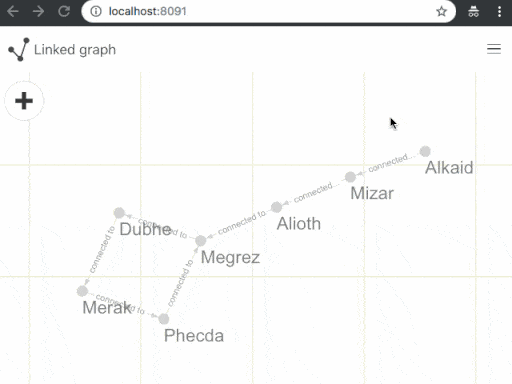

# Linked graph

**Linked graph** is a demo Web application which allows to build, edit and view linked graph data structures.
One of important functionalities is a *live layout* which adjusts positions of objects based on link constraints between them.

- Automatic live graph force layout.
- Move objects with drag and drop.
- Editing of objects and managing connections.
- Displaying link directions and text.
- Zooming and panning.
- Possibility to undo 5 last operations.
- Mobile friendly.

**Live demo** is deployed here: [https://megaboich.github.io/linked-graph](https://megaboich.github.io/linked-graph).
              
Used 3rd party libraries and assets:

- [Webcola](https://github.com/tgdwyer/WebCola) is a JavaScript constraint-based graph layout library.
- [React](https://reactjs.org/) is a JavaScript library for building user interfaces.
- [Redux](https://redux.js.org/) is a predictable state container for JavaScript apps.
- [React Select](https://react-select.com/home) is a flexible and beautiful Select Input control for ReactJS with multiselect, autocomplete, async and creatable support.
- [Bulma](https://github.com/jgthms/bulma) is a free, open source CSS framework based on Flexbox.
- [Open iconic](https://github.com/iconic/open-iconic) is an open source icon set with 223 marks in SVG, webfont and raster formats.

### Delevopment
This application is written in [TypeScript]() and is using [Webpack]() tool to build the application.
You need [NodeJS](https://nodejs.org/en/) installed in your system. [Yarn](https://yarnpkg.com/en/) is optional but nice to have. Recommended IDE is [VSCode]() with these plugins: [TSLint](https://github.com/Microsoft/vscode-typescript-tslint-plugin), [Prettier](https://marketplace.visualstudio.com/items?itemName=esbenp.prettier-vscode).

- Install packages: `npm i` or `yarn`
- Run development server: `npm start` or `yarn start`
- Build release version: `npm run build` or `yarn build`
